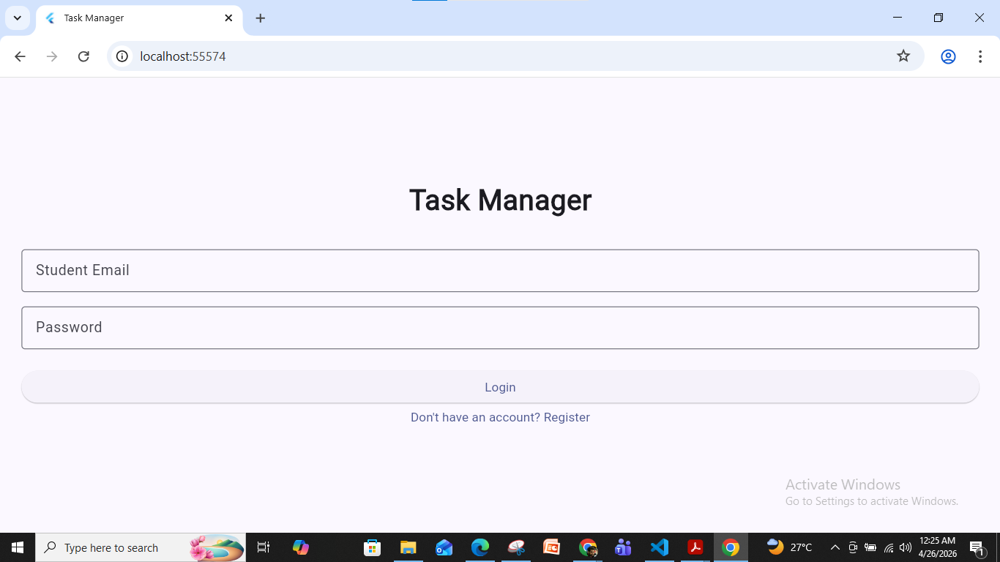
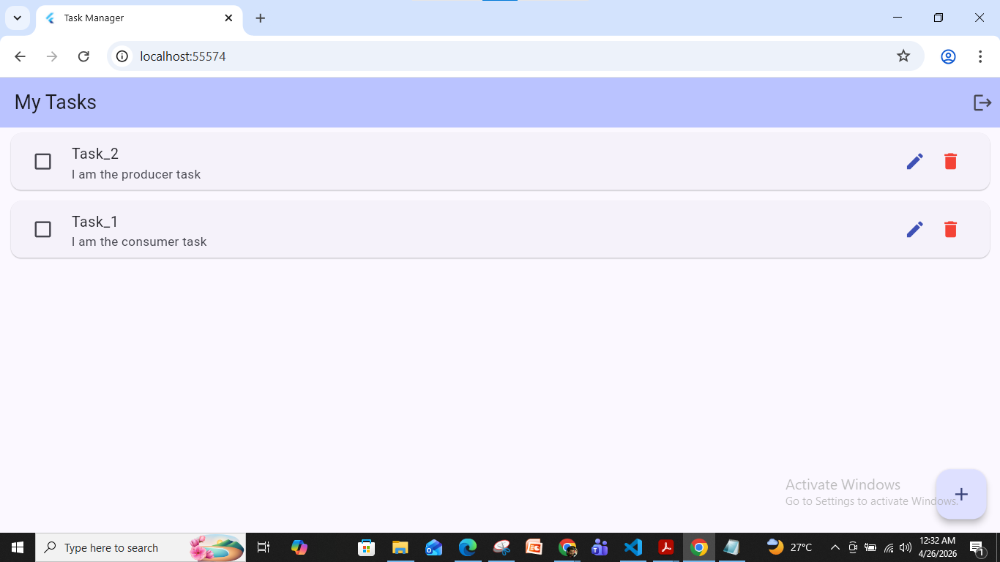
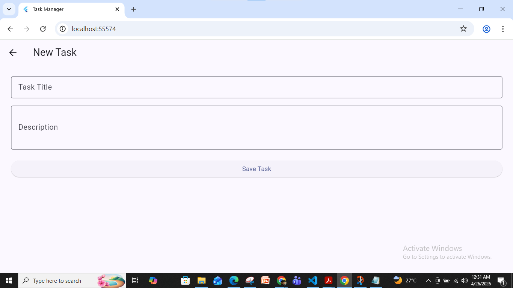
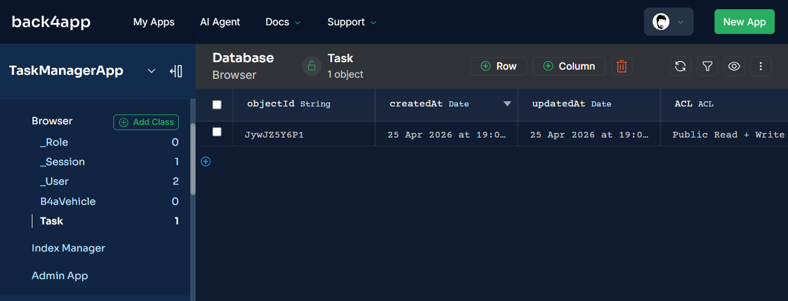

# Task Manager App – Flutter + Back4App (BaaS)

A CRUD Task Manager built with Flutter and Back4App as part of the
Cross-Platform Application Development course (BITS Pilani WILP).

##  Demo Video
[Click here to watch the demo](https://youtu.be/IYBR9rBShZs)

##  Screenshots

### Login Screen


### Home Screen


### Add Task


### Edit Task


### Back4App Database


## Features
- User Registration & Login using student email
- Create, Read, Update, Delete tasks
- Mark tasks as complete
- Real-time sync with Back4App cloud database
- Secure logout

## Tech Stack
| Layer | Technology |
|-------|-----------|
| Frontend | Flutter (Dart) |
| Backend | Back4App (Parse Server) |
| Database | Back4App Cloud Database |
| Version Control | GitHub |

## Setup Instructions
1. Clone the repo
```bash
   git clone https://github.com/YOUR_USERNAME/task_manager_app.git
   cd task_manager_app
```
2. Install dependencies
```bash
   flutter pub get
```
3. Add your Back4App keys in `lib/main.dart`
```dart
   const keyApplicationId = 'YOUR_APP_ID';
   const keyClientKey = 'YOUR_CLIENT_KEY';
```
4. Run the app
```bash
   flutter run -d chrome
```

##  Project Structure
lib/
├── main.dart
├── models/
│   └── task_model.dart
├── screens/
│   ├── login_screen.dart
│   ├── register_screen.dart
│   ├── home_screen.dart
│   └── task_form_screen.dart
└── services/
    └──parse_service.dart

## Author
Your Name – 2024mt13064@wilp.bits-pilani.ac.in
BITS Pilani WILP